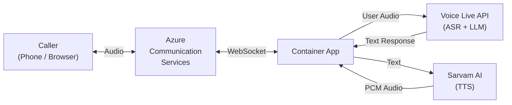
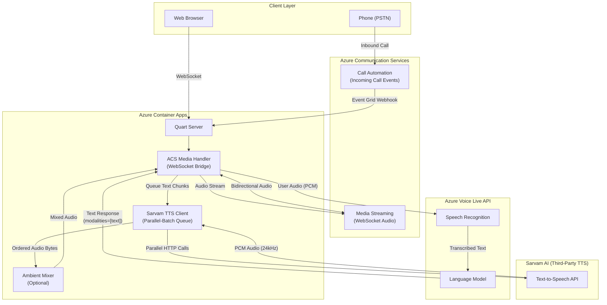
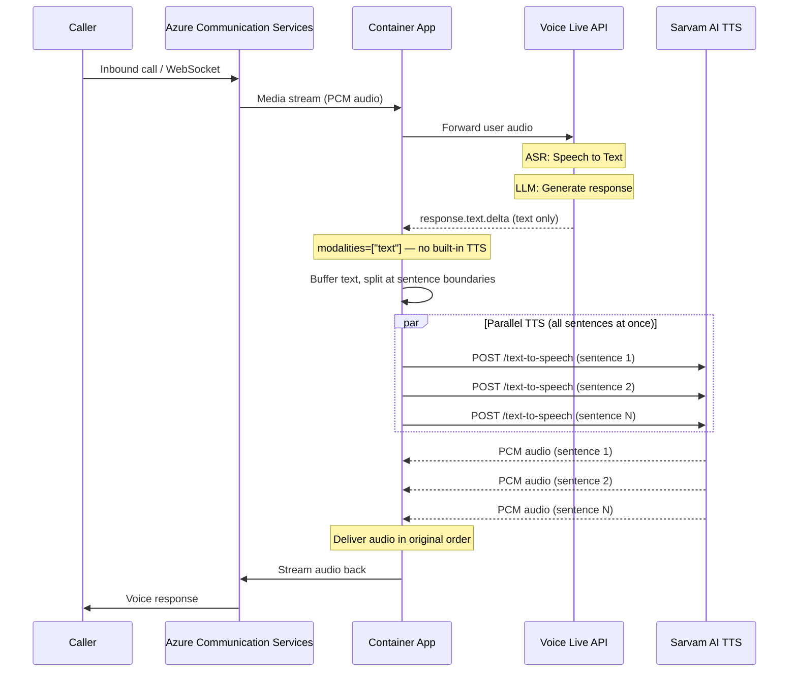

# Integrating Azure Voice Live API with Third-Party TTS (Sarvam AI)

A reference implementation showing how to use **Azure Voice Live API** in **text-only mode** with a third-party Text-to-Speech provider — in this case, [Sarvam AI](https://www.sarvam.ai/) for high-quality Indian language voices.

<div align="center">

[**Why Third-Party TTS?**](#why-third-party-tts) \| [**Architecture**](#architecture) \| [**Key Optimizations**](#key-optimizations) \| [**Getting Started**](#getting-started) \| [**Configuration**](#configuration) \| [**Testing**](#testing-the-agent)

</div>

<br/>

> **Note:** This project is a modified fork of the [Call Center Voice Agent Accelerator](https://github.com/Azure-Samples/call-center-voice-agent-accelerator). It demonstrates a Bring-Your-Own-TTS pattern applicable to any third-party TTS provider.

<br/>

## Why Third-Party TTS?

Azure Voice Live API bundles ASR + LLM + TTS into a single low-latency pipeline. However, you may want to **bring your own TTS** when:

- You need voices in **languages or dialects** not yet supported by Voice Live's built-in TTS
- You require a **specific voice identity** (brand voice, regional accent)
- Your use case demands **specialized speech characteristics** (pace, intonation, style)

The key insight: setting `modalities: ["text"]` in the Voice Live session config tells the API to **skip built-in audio generation** and return only text responses. Your application can then route that text to any TTS provider.

```python
# server/app/handler/acs_media_handler.py
"session": {
    "modalities": ["text"],  # Voice Live returns text only, no audio
    ...
}
```

<br/>

## Architecture

### High-Level Flow



### Detailed Architecture



### Data Flow (Sequence)



<br/>

## Key Optimizations

This implementation includes several latency optimizations for production-quality voice interactions:

### 1. Parallel-Batch TTS Queue

Instead of synthesizing sentences one-by-one (sequential), all queued sentences are fired **simultaneously** to the Sarvam API and delivered in order. For N sentences, latency drops from `sum(t1…tN)` to `max(t1…tN)`.

```python
# server/app/handler/sarvam_tts.py — _tts_worker()
batch = [text]
while not self._tts_queue.empty():
    batch.append(self._tts_queue.get_nowait())

# Fire ALL TTS calls in parallel
tasks = [asyncio.create_task(self.synthesize(t)) for t in texts]

# Deliver audio strictly in order
for task in tasks:
    pcm_bytes = await task
    await self._audio_callback(pcm_bytes)
```

### 2. Persistent HTTP Connection Pool

Reuses TCP+TLS connections across TTS calls, eliminating ~100-300ms handshake overhead per request.

```python
self._http_client = httpx.AsyncClient(
    timeout=httpx.Timeout(connect=5.0, read=10.0, write=5.0, pool=10.0),
    limits=httpx.Limits(max_connections=6, max_keepalive_connections=4),
)
```

### 3. Sentence Boundary Splitting

Text is split at natural sentence boundaries (`. ! ? ।`) with a minimum length threshold before flushing, balancing latency vs. natural speech cadence.

### 4. Automatic Retry on Timeout

If a TTS call times out, it retries once automatically — critical for production reliability over variable network conditions.

### 5. Ambient Audio Mixing (Optional)

Realistic background audio (office sounds, call center ambiance) can be mixed into the TTS output for a natural call experience.

<br/>

## Getting Started

### Prerequisites

- [Azure subscription](https://azure.microsoft.com/free/) with permissions to create resource groups
- [Azure CLI](https://learn.microsoft.com/cli/azure/what-is-azure-cli): `az`
- [Azure Developer CLI](https://learn.microsoft.com/azure/developer/azure-developer-cli/overview): `azd`
- [Python 3.11+](https://www.python.org/about/gettingstarted/)
- [UV](https://docs.astral.sh/uv/getting-started/installation/): `uv`
- A [Sarvam AI API key](https://dashboard.sarvam.ai) for TTS

### Azure Services Used

| Service | Role | Pricing |
|---|---|---|
| [Azure Voice Live API](https://learn.microsoft.com/azure/ai-services/speech-service/voice-live/) | Real-time ASR + LLM (text-only mode) | [Pricing](https://azure.microsoft.com/pricing/details/cognitive-services/speech-services/) |
| [Azure Communication Services](https://learn.microsoft.com/azure/communication-services/overview) | Telephony and call handling | [Pricing](https://azure.microsoft.com/pricing/details/communication-services/) |
| [Azure Container Apps](https://learn.microsoft.com/azure/container-apps/) | Hosts the voice agent | [Pricing](https://azure.microsoft.com/pricing/details/container-apps/) |
| [Azure Container Registry](https://learn.microsoft.com/azure/container-registry/) | Container image storage | [Pricing](https://azure.microsoft.com/pricing/details/container-registry/) |

### Deploy

1. **Clone and set up:**
   ```shell
   git clone <this-repo-url>
   cd call-center-sarvam-tts
   ```

2. **Configure the Sarvam API key:**
   ```shell
   azd env set SARVAM_API_KEY <your-sarvam-api-key>
   ```

3. **Login and deploy:**
   ```shell
   azd auth login
   azd up
   ```
   Select a region when prompted. The Voice Live API is currently available in **swedencentral** and **eastus2** (the Bicep handles this — your container deploys in your chosen region while AI services deploy to swedencentral).

4. **Redeploy after code changes:**
   ```shell
   azd deploy
   ```

> [!NOTE]
> Post-deployment, set up the ACS Event Grid subscription for phone call support. See [Testing the Agent](#-acs-phone-client-call-center-scenario).

<br/>

## Configuration

### Environment Variables

All configuration is via environment variables. See [`server/.env-sample.txt`](./server/.env-sample.txt) for the full list.

| Variable | Description | Default |
|---|---|---|
| `AZURE_VOICE_LIVE_ENDPOINT` | Voice Live API endpoint (auto-set by azd) | — |
| `VOICE_LIVE_MODEL` | Model deployment name | — |
| `ACS_CONNECTION_STRING` | ACS connection string (stored in Key Vault) | — |
| `SARVAM_API_KEY` | Sarvam AI API key | — |
| `SARVAM_SPEAKER` | Voice name ([options](https://docs.sarvam.ai/api-reference-docs/text-to-speech)) | `kavya` |
| `SARVAM_TARGET_LANGUAGE` | Language code for TTS output | `hi-IN` |
| `SARVAM_PACE` | Speech speed multiplier | `1.35` |
| `SARVAM_TEMPERATURE` | Voice variation (0.0–1.0) | `0.7` |
| `AMBIENT_PRESET` | Background audio: `none`, `office`, `call_center` | `none` |

### Customizing for a Different TTS Provider

To replace Sarvam with another TTS provider:

1. **Create a new TTS client** similar to [`server/app/handler/sarvam_tts.py`](./server/app/handler/sarvam_tts.py) implementing:
   - `set_audio_callback(callback)` — receives the function to call with PCM audio bytes
   - `add_text(text)` — streams text from Voice Live into your TTS queue
   - `flush()` — synthesizes any remaining buffered text
   - `close()` — cleanup resources

2. **Update [`acs_media_handler.py`](./server/app/handler/acs_media_handler.py)** to instantiate your TTS client instead of `SarvamTTS`

3. **Ensure audio format compatibility**: Voice Live expects 24kHz 16-bit mono PCM

<br/>

## Testing the Agent

### Web Client (Quick Test)

1. Navigate to your **Container App** in the [Azure Portal](https://portal.azure.com)
2. Copy the **Application URL** from the Overview page
3. Open the URL in your browser
4. Click **Start Talking to Agent** to begin a voice session

> This web client is for testing only. Use the ACS client for production-like call testing.

### ACS Phone Client (Call Center Scenario)

#### 1. Set Up Incoming Call Webhook

1. Open the **Communication Services** resource in your resource group
2. Go to **Events** > **+ Event Subscription**
3. Configure:
   - **Event Type**: `IncomingCall`
   - **Endpoint Type**: `Web Hook`
   - **Endpoint**: `https://<your-container-app-url>/acs/incomingcall`


#### 2. Get a Phone Number

[How to get a phone number](https://learn.microsoft.com/azure/communication-services/quickstarts/telephony/get-phone-number?tabs=windows&pivots=platform-azp-new)

#### 3. Call the Agent

Dial the ACS number — your call connects to the real-time voice agent.

### Local Development

See [`server/README.md`](./server/README.md) for local execution instructions.

<br/>

## Optional Features

### Ambient Scenes

Add realistic background audio to simulate real-world call center environments.

| Preset | Description |
|--------|-------------|
| `none` | Disabled (default) |
| `office` | Quiet office ambient |
| `call_center` | Busy call center background |
| *custom* | Your own audio files |

```bash
# Enable ambient audio
azd env set AMBIENT_PRESET call_center
azd deploy
```

See the [ambient mixer source](./server/app/handler/ambient_mixer.py) for custom audio file instructions. Audio files must be WAV, 24kHz, 16-bit mono PCM, 30-60 seconds.

### Foundry Agents Integration

Voice Live supports connecting to [Azure AI Foundry Agents](https://learn.microsoft.com/azure/ai-services/speech-service/voice-live-agents-quickstart) for pre-built capabilities, knowledge bases, and orchestration features.

<br/>

## Project Structure

```
server/
  server.py                          # Quart web server, config loading
  app/handler/
    acs_event_handler.py             # ACS incoming call webhook handler
    acs_media_handler.py             # WebSocket bridge: client <-> Voice Live <-> TTS
    sarvam_tts.py                    # Sarvam AI TTS client (parallel-batch queue)
    ambient_mixer.py                 # Optional background audio mixing
  app/data/
    puri_bank_mock_accounts.json     # Sample mock data for the demo agent
  static/
    index.html                       # Browser test client
infra/
  main.bicep                         # Infrastructure-as-code entry point
  modules/                           # Bicep modules (AI Services, Container App, ACS, etc.)
```

<br/>

## Guidance

### Resource Clean-up

```bash
azd down
```

<br/>

## Resources

- [Voice Live API overview](https://learn.microsoft.com/azure/ai-services/speech-service/voice-live)
- [Voice Live API blog post](https://techcommunity.microsoft.com/blog/azure-ai-foundry-blog/upgrade-your-voice-agent-with-azure-ai-voice-live-api/4458247)
- [Azure Speech Service](https://learn.microsoft.com/azure/ai-services/speech-service/)
- [Azure Communication Services](https://learn.microsoft.com/azure/communication-services/concepts/call-automation/call-automation)
- [Sarvam AI TTS docs](https://docs.sarvam.ai/api-reference-docs/text-to-speech)

<br/>

## Security Considerations

- ACS connection string is stored in **Azure Key Vault** and injected via secret reference
- Voice Live API authentication uses **Managed Identity** (no API keys in production)
- The Sarvam API key is passed as an environment variable — for production, consider storing it in Key Vault as well

<br/>

## Disclaimers

This project is provided as a reference implementation. You are responsible for assessing risks and complying with applicable laws and safety standards. See the transparency documents for [Voice Live API](https://learn.microsoft.com/azure/ai-foundry/responsible-ai/speech-service/voice-live/transparency-note) and [Azure Communication Services](https://learn.microsoft.com/azure/communication-services/concepts/privacy).

## Trademarks

This project may contain trademarks or logos for projects, products, or services. Authorized use of Microsoft trademarks or logos is subject to [Microsoft's Trademark & Brand Guidelines](https://www.microsoft.com/en-us/legal/intellectualproperty/trademarks/usage/general). Any use of third-party trademarks or logos are subject to those third-party's policies.
